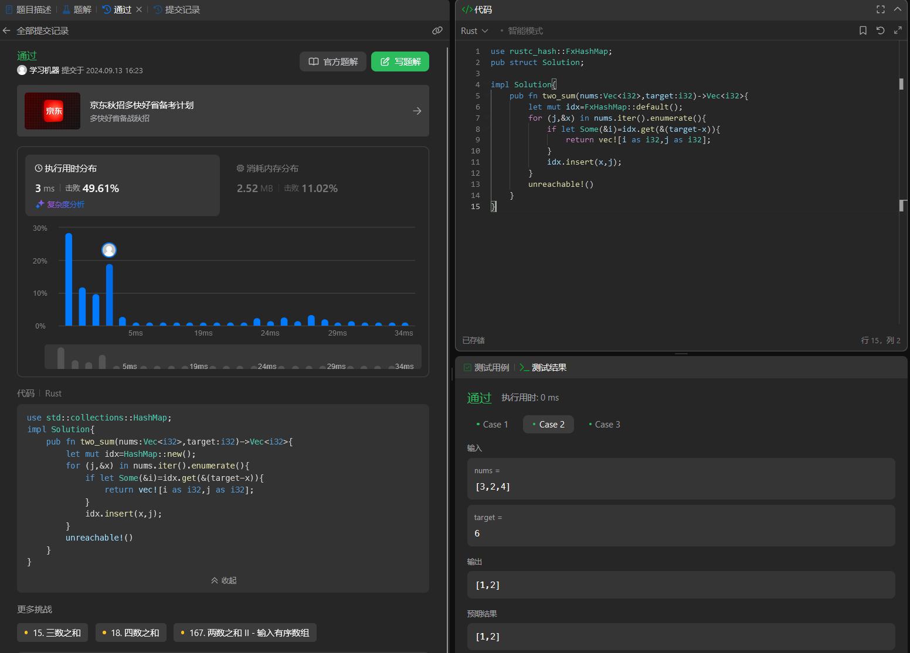

# main
```rust
use leetcode::Solution;
fn main(){
    let v=vec![1,2,3,4,5,6];
    let target=5;
    let s=Solution::two_sum(v,target);
    println!("{:?}",s);
}
```

1. 第一个 hashman方法

```rust
use std::collections::HashMap;
pub struct Solution;

impl Solution{
    pub fn two_sum(nums:Vec<i32>,target:i32)->Vec<i32>{
        let mut idx=HashMap::new();
        for (j,&x) in nums.iter().enumerate(){
            if let Some(&i)=idx.get(&(target-x)){
                return vec![i as i32,j as i32];
            }
            idx.insert(x,j);
        }
        unreachable!()
    }
}
```

2. 第二个
```rust
use rustc_hash::FxHashMap;
pub struct Solution;

impl Solution{
    pub fn two_sum(nums:Vec<i32>,target:i32)->Vec<i32>{
        let mut idx=FxHashMap::default();
        for (j,&x) in nums.iter().enumerate(){
            if let Some(&i)=idx.get(&(target-x)){
                return vec![i as i32,j as i32];
            }
            idx.insert(x,j);
        }
        unreachable!()
    }
}
```
